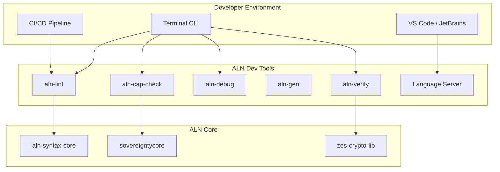

# ALN Developer Tools Architecture

## Overview

`aln-dev-tools` is the **Developer Experience Layer** of the Sovereign Spine, providing CLI tools, IDE extensions, and linting utilities that catch capability violations at development time.

## Architecture Diagram

Key Design Principles
Early Detection - Catch issues before deployment
IDE Integration - Real-time feedback in editor
Non-Weaponization - Prevent accidental weapon-like patterns
Open Source - All tools publicly auditable (MIT License)
Offline-Capable - Work without network connectivity

CLI Tools
[table-b2cb6ca1-58ae-4ae1-aa75-3ff370947907 (2).csv](https://github.com/user-attachments/files/25729663/table-b2cb6ca1-58ae-4ae1-aa75-3ff370947907.2.csv)
Tool,Purpose,Exit Code
aln-lint,Lint ALN files,"0 = pass, 1 = fail"
aln-verify,Verify zes-envelopes,"0 = valid, 1 = invalid"
aln-debug,Debug with NDM visibility,0 = success
aln-gen,Generate from templates,0 = success
aln-cap-check,Check capabilities,"0 = pass, 1 = fail"

Lint Rules
[table-b2cb6ca1-58ae-4ae1-aa75-3ff370947907 (3).csv](https://github.com/user-attachments/files/25729675/table-b2cb6ca1-58ae-4ae1-aa75-3ff370947907.3.csv)
Rule ID,Severity,Description
SCHEMA_VALID,Error,Schema validation
CAP_FORBIDDEN_COMBO,Error,Forbidden capability combinations
NON_WEAPON_CHECK,Warning,Non-weaponization patterns
STYLE_TRAILING_WS,Hint,Trailing whitespace

IDE Support
[table-b2cb6ca1-58ae-4ae1-aa75-3ff370947907 (4).csv](https://github.com/user-attachments/files/25729695/table-b2cb6ca1-58ae-4ae1-aa75-3ff370947907.4.csv)
Rule ID,Severity,Description
SCHEMA_VALID,Error,Schema validation
CAP_FORBIDDEN_COMBO,Error,Forbidden capability combinations
NON_WEAPON_CHECK,Warning,Non-weaponization patterns
STYLE_TRAILING_WS,Hint,Trailing whitespace

Security Properties
Static Analysis - Capability violations caught at compile time
Envelope Verification - Zes-encryption verified before deployment
NDM Visibility - Developers see NDM impact of their code
Non-Weaponization - Accidental weapon-like patterns flagged
Audit Trail - All lint/verify actions logged to ROW/RPM
Document Hex-Stamp: 0x7a8b9c0d1e2f3a4b5c6d7e8f9a0b1c2d3e4f5a6b7c8d9e0f1a2b3c4d5e6f7a8b
Last Updated: 2026-03-04
